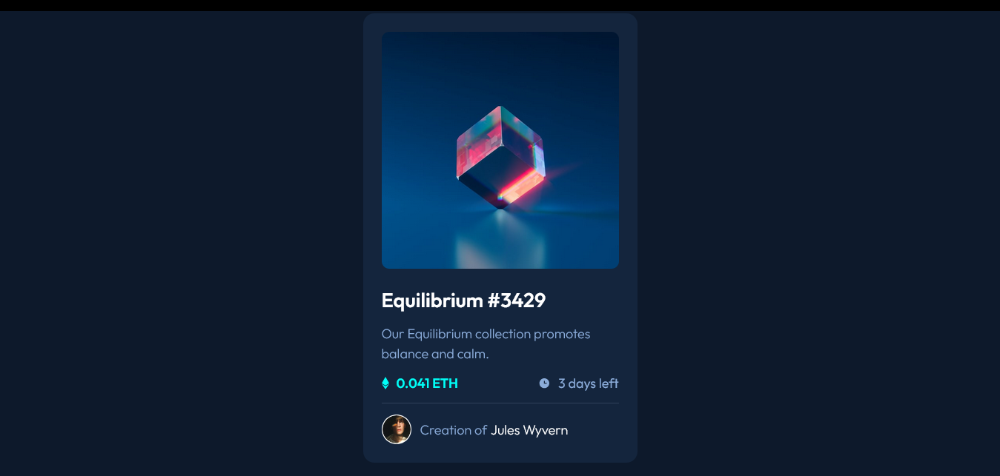

# Frontend Mentor - NFT preview card component solution

This is a solution to the [NFT preview card component challenge on Frontend Mentor](https://www.frontendmentor.io/challenges/nft-preview-card-component-SbdUL_w0U). Frontend Mentor challenges help you improve your coding skills by building realistic projects. 

## Table of contents

- [Overview](#overview)
  - [The challenge](#the-challenge)
  - [Screenshot](#screenshot)
  - [Links](#links)
- [My process](#my-process)
  - [Built with](#built-with)
  - [What I learned](#what-i-learned)
  - [Continued development](#continued-development)

**Note: Delete this note and update the table of contents based on what sections you keep.**

## Overview

### The challenge

Users should be able to:

- View the optimal layout depending on their device's screen size
- See hover states for interactive elements

### Screenshot

### Links

- Solution URL: [Code Here](https://github.com/stravse/frontendMentor-NFT-preview-card)
- Live Site URL: [Add live site URL here](https://stravse.github.io/frontendMentor-NFT-preview-card/)

## My process
Tried to figure out how the hover effect of the image worked.
The rest was just structuring and some CSS
### Built with

- Semantic HTML5 markup
- CSS custom properties
- Flexbox

### What I learned

I have learned a few about element stacking with the position property and how to manipulate them with z-index

### Continued development

I would like to learn more about how to make websites more responsive 

